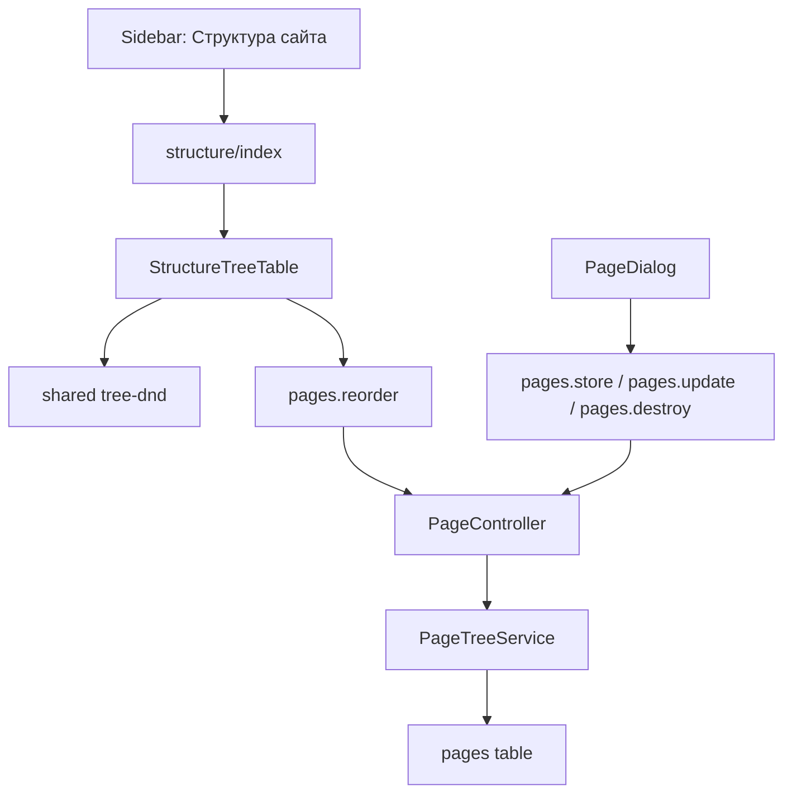

# Управление структурой сайта

Структура сайта — раздел управления древовидной таблицей `pages`. Эти данные используются как административная модель URL-структуры организации и в дальнейшем будут основой для автоматической генерации статического сайта.

## Назначение

Раздел «Структура сайта» управляет страницами текущей организации:

- показывает страницы в древовидной таблице;
- создаёт корневые и дочерние страницы;
- редактирует название, `slug`, статус и базовые SEO-поля;
- удаляет только страницы без потомков;
- меняет порядок и вложенность через drag and drop;
- сохраняет `parent_id`, `sort_order`, `depth`, `path`;
- помечает изменённые страницы как `needs_generation = true`.

Название «Страницы» не используется для Inertia-экрана, потому что оно конфликтует с технической папкой `resources/js/pages` и приводит к повтору `resources/js/pages/pages/index.tsx`.

## Принятый нейминг

Используется название `structure` для frontend-экрана и «Структура сайта» для интерфейса. Экран управляет не просто списком страниц, а деревом сайта: порядком, вложенностью и URL-структурой.

- Пункт меню: «Структура сайта».
- Inertia component: `structure/index`.
- Файл экрана: `resources/js/pages/structure/index.tsx`.
- React component: `StructureIndex`.
- Feature slice: `resources/js/features/structure`.
- Таблица и доменная сущность остаются `pages` / `Page`, потому что на backend это именно страница сайта.
- Имена маршрутов остаются `pages.*`, например `pages.index`, `pages.store`, `pages.reorder`.

Так мы убираем повтор `resources/js/pages/pages/index.tsx`, но не переименовываем backend-домен в менее точное «структура». `structure` — это название экрана управления, `Page` — название сущности.

Отклонённые варианты: `sitemap` может путаться с публичным `sitemap.xml`, `site-sections` хуже подходит для обычных страниц, `content-pages` длиннее и снова возвращает слово pages в frontend path, `site-navigation` сужает смысл до меню.

## Реализованное состояние

- Маршрут подключён в `routes/web.php` через `PageController`: `GET {current_org}/structure` отдаёт Inertia component `structure/index`.
- UI-экран находится в `resources/js/pages/structure/index.tsx`.
- Sidebar отображает пункт «Структура сайта» и ведёт на route `pages.index`.
- Таблица `pages` создана миграцией `database/migrations/2026_04_29_133500_pages.php`.
- Модель `Page` использует `SoftDeletes`, enum `PageStatus`, связи с организацией, автором, проверяющим, родителем и дочерними страницами.
- Backend использует `PageController`, `StorePageRequest`, `UpdatePageRequest`, `ReorderPagesRequest` и `PageTreeService`.
- Frontend использует `StructureIndex`, `StructureTreeTable`, `PageDialog`, `PageFormFields`, entity-типы `PageListRow` / `PageStatus` и общий слой `shared/lib/tree-dnd`.
- Wayfinder routes сгенерированы для `pages.index`, `pages.store`, `pages.reorder`, `pages.update`, `pages.destroy`.

## Пользовательское поведение

- В sidebar раздел отображается как «Структура сайта».
- URL раздела: `/{current_team}/{current_org}/structure`.
- Inertia component: `structure/index`.
- Экран показывает древовидную таблицу страниц текущей организации.
- Пользователь может создать корневую страницу или дочернюю страницу.
- Пользователь может редактировать название, slug, статус и базовые SEO-поля.
- Пользователь может удалить только страницу без потомков.
- Пользователь может менять порядок и вложенность через drag and drop.
- После drag and drop backend сохраняет `parent_id`, `sort_order`, `depth`, `path`.
- При изменениях, влияющих на итоговый HTML, страница помечается `needs_generation = true`.

## Структура файлов

Backend:

- `app/Models/Page.php`
- `app/Enums/PageStatus.php`
- `app/Http/Controllers/Orgs/PageController.php`
- `app/Http/Requests/Pages/StorePageRequest.php`
- `app/Http/Requests/Pages/UpdatePageRequest.php`
- `app/Http/Requests/Pages/ReorderPagesRequest.php`
- `app/Services/Pages/PageTreeService.php`

Frontend:

- `resources/js/pages/structure/index.tsx`
- `resources/js/features/structure/ui/structure-tree-table.tsx`
- `resources/js/features/structure/ui/page-dialog.tsx`
- `resources/js/features/structure/ui/page-form-fields.tsx`
- `resources/js/features/structure/index.ts`
- `resources/js/entities/page/model/types.ts`
- `resources/js/entities/page/index.ts`

Важно: `resources/js/pages/structure/index.tsx` убирает повтор `pages/pages`, а `entities/page` сохраняет корректное имя доменной сущности.

## Backend

### Routes

- `GET {current_org}/structure` → `PageController@index`, name `pages.index`.
- `POST {current_org}/structure` → `PageController@store`, name `pages.store`.
- `PATCH {current_org}/structure/reorder` → `PageController@reorder`, name `pages.reorder`.
- `PATCH {current_org}/structure/{page}` → `PageController@update`, name `pages.update`.
- `DELETE {current_org}/structure/{page}` → `PageController@destroy`, name `pages.destroy`.

### `PageController`

- `index()` загружает страницы текущей организации, считает `children_count` и отдаёт `structure/index` с props `pages` и `pageStatuses`.
- `store()` создаёт страницу, вычисляет `slug`, `path`, `depth`, `sort_order`, автора и `needs_generation`.
- `update()` обновляет страницу и пересчитывает `path` / `depth` для ветки при смене `slug` или родителя.
- `reorder()` принимает полный payload дерева и сохраняет порядок в транзакции.
- `destroy()` удаляет только leaf-страницы. Если есть потомки, возвращает validation error.

### `PageTreeService`

- `flattenTreeRows()` строит плоский список строк для Inertia.
- `buildUniqueSlug()` подбирает свободный slug по итоговому `path`.
- `buildPath()` собирает путь из родительского `path` и текущего `slug`.
- `nextSiblingSortOrder()` считает следующую позицию внутри sibling-группы.
- `rebuildSubtreePaths()` пересчитывает `path` / `depth` для ветки.
- `applyReorderPayload()` применяет полный reorder payload, нормализует `sort_order` и пересчитывает структуру.

### Form Requests

- `StorePageRequest` проверяет `title`, optional `slug`, nullable `parent_id`, `status`, SEO-поля и `noindex`.
- `UpdatePageRequest` дополнительно запрещает выбрать себя или потомка родителем.
- `ReorderPagesRequest` проверяет полный набор страниц текущей организации, отсутствие дублей, чужих id, self-parent, циклов и дублирующихся итоговых `path`.

## Frontend

### `StructureIndex`

- Находится в `resources/js/pages/structure/index.tsx`.
- Отображает заголовок, краткое описание, toolbar и таблицу структуры.
- Breadcrumb title: «Структура сайта».
- Получает props `pages: PageListRow[]` и `pageStatuses: PageStatus[]`.

### `StructureTreeTable`

- Находится в `resources/js/features/structure/ui/structure-tree-table.tsx`.
- Использует `@dnd-kit/core`.
- Использует `projectTreeMove()` и `buildTreeReorderPayload()` из `shared/lib/tree-dnd`.
- Делает optimistic update при drag and drop и rollback при ошибке.
- Отправляет reorder через `router.patch(pages.reorder.url(...), { items })`.

### `PageDialog` и `PageFormFields`

- Диалог создания/редактирования находится в `resources/js/features/structure/ui/page-dialog.tsx`.
- Поля формы вынесены в `resources/js/features/structure/ui/page-form-fields.tsx`.
- Submit использует Inertia `<Form>` и Wayfinder `.form()` из `@/routes/pages`.
- Удаление использует `router.delete()` и route `pages.destroy`.
- Поля первого этапа: `title`, `slug`, `parent_id`, `status`, `seo_title`, `meta_description`, `noindex`.

### Entity-типы

`PageListRow` находится в `resources/js/entities/page/model/types.ts` и содержит:

- `id`, `parent_id`, `depth`;
- `slug`, `path`, `title`, `status`;
- `seo_title`, `meta_description`, `noindex`;
- `sort_order`, `children_count`, `updated_at`.

## Инварианты дерева

- Страница принадлежит только одной организации.
- `parent_id` может ссылаться только на страницу той же организации.
- Страница не может быть родителем самой себе.
- Страница не может быть перемещена внутрь собственного потомка.
- `sort_order` хранится внутри sibling-группы.
- `path` уникален в рамках организации.
- `path` пересчитывается для всей ветки при смене `slug` или родителя.
- Страницу с потомками удалить нельзя; сначала нужно удалить или переместить дочерние страницы.

## Схема потока

## Тестирование

- `tests/Feature/PagesPageTest.php` проверяет component `structure/index`, prop `pages` и список `pageStatuses`.
- Проверяется создание корневой страницы с генерацией уникального slug.
- Проверяется создание дочерней страницы с корректными `path`, `depth`, `sort_order`.
- Проверяется обновление slug родителя и пересчёт `path` у потомков.
- Проверяется reorder: порядок, вложенность, `path` и `depth` сохраняются.
- Проверяется reorder validation: неполный payload, дубли, циклы и чужая организация отклоняются.
- Проверяется удаление leaf-страницы.
- Проверяется запрет удаления страницы с потомками.

## Проверки

- `php artisan wayfinder:generate --with-form --no-interaction`
- `vendor/bin/pint --dirty --format agent`
- `php artisan test --compact tests/Feature/PagesPageTest.php`
- `npm run types:check`
- `npx eslint resources/js/features/structure resources/js/pages/structure resources/js/entities/page resources/js/widgets/app-sidebar.tsx`
- Вручную проверить сценарий: создать несколько страниц, вложить одну в другую drag and drop, обновить страницу браузера и убедиться, что порядок сохранился.

