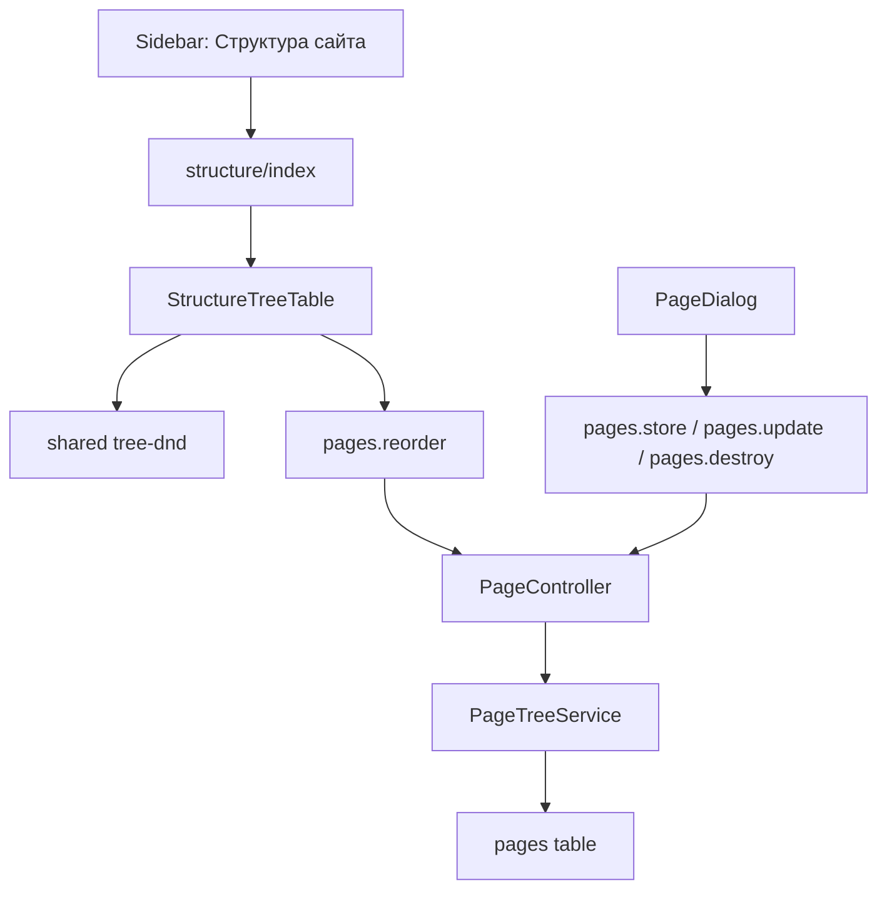

# Управление структурой сайта

Структура сайта - таблица pages древовидная, в дальнейшем будет использоваться для автоматической генерации статического сайта.

## Задача

Существующий раздел «Страницы» пока пустой. 
Нужно превратить его в полноценное управление структурой сайта текущей организации: древовидная таблица страниц, создание и редактирование узлов, удаление, изменение порядка и вложенности через drag and drop.

Главное замечание по неймингу: название «Страницы» конфликтует с технической папкой Inertia `resources/js/pages`, из-за чего появляется повтор `resources/js/pages/pages/index.tsx`. Для продукта и кода лучше разделить пользовательское название раздела и техническое имя Inertia-страницы.

## Принятый нейминг

Используем название `structure` для frontend-экрана и «Структура сайта» для интерфейса. Это короткий и понятный вариант для текущей задачи, потому что экран управляет не просто списком страниц, а деревом сайта: порядком, вложенностью и URL-структурой.

- Пункт меню: «Структура сайта».
- Inertia component: `structure/index`.
- Файл экрана: `resources/js/pages/structure/index.tsx`.
- React component: `StructureIndex`.
- Feature slice: `resources/js/features/structure`.
- Таблица и доменная сущность остаются `pages` / `Page`, потому что на backend это именно страница сайта.
- Имена маршрутов остаются `pages.*`, например `pages.index`, `pages.store`, `pages.reorder`.

Так мы убираем повтор `resources/js/pages/pages/index.tsx`, но не переименовываем backend-домен в менее точное «структура». `structure` — это название экрана управления, `Page` — название сущности.

Отклонённые варианты: `sitemap` может путаться с публичным `sitemap.xml`, `site-sections` хуже подходит для обычных страниц, `content-pages` длиннее и снова возвращает слово pages в frontend path, `site-navigation` сужает смысл до меню.

## Текущая база

- Маршрут подключён в `routes/web.php` через `PageController`: `GET {current_org}/structure` отдаёт Inertia component `structure/index`.
- UI-экран находится в `resources/js/pages/structure/index.tsx`.
- Таблица `pages` уже создана миграцией `database/migrations/2026_04_29_133500_pages.php`.
- В таблице уже есть поля для дерева и сайта: `org_id`, `parent_id`, `slug`, `path`, `depth`, `sort_order`, `status`, `title`, `content`, SEO-поля, `needs_generation`.
- Управление категориями уже реализует похожую механику через `CategoryController`, `ReorderCategoriesRequest`, `resources/js/features/category/ui/categories-tree-table.tsx` и общий слой `resources/js/shared/lib/tree-dnd`.

## Целевое поведение

- В sidebar раздел отображается как «Структура сайта».
- URL раздела: `/{current_team}/{current_org}/structure`.
- Inertia component лучше поменять с `pages/index` на `structure/index`.
- Экран показывает древовидную таблицу страниц текущей организации.
- Пользователь может создать корневую страницу или дочернюю страницу.
- Пользователь может редактировать название, slug, статус и базовые SEO-поля.
- Пользователь может удалить страницу без потомков.
- Пользователь может менять порядок и вложенность через drag and drop.
- После drag and drop backend сохраняет `parent_id`, `sort_order`, `depth`, `path`.
- При изменениях, влияющих на итоговый HTML, страница помечается `needs_generation = true`.

## Рекомендуемая структура файлов

Backend:

- `app/Models/Page.php`
- `app/Enums/PageStatus.php`
- `app/Http/Controllers/Orgs/PageController.php`
- `app/Http/Requests/Pages/StorePageRequest.php`
- `app/Http/Requests/Pages/UpdatePageRequest.php`
- `app/Http/Requests/Pages/ReorderPagesRequest.php`
- `app/Services/Pages/PageTreeService.php`

Frontend:

- `resources/js/pages/structure/index.tsx`
- `resources/js/features/structure/ui/structure-tree-table.tsx`
- `resources/js/features/structure/ui/page-dialog.tsx`
- `resources/js/features/structure/ui/page-form-fields.tsx`
- `resources/js/features/structure/index.ts`
- `resources/js/entities/page/model/types.ts`
- `resources/js/entities/page/index.ts`

Важно: `resources/js/pages/structure/index.tsx` убирает повтор `pages/pages`, а `entities/page` сохраняет корректное имя доменной сущности.

## Backend план

1. Создать модель `Page`.
  - Добавить `SoftDeletes`.
  - Описать связи `org()`, `author()`, `reviewer()`, `parent()`, `children()`.
  - Добавить casts для дат, `noindex`, `needs_generation`.
  - Добавить fillable для полей страницы.
2. Создать enum `PageStatus`.
  - Минимальные значения: `draft`, `review`, `published`.
  - Использовать enum в валидации и при создании страницы по умолчанию.
3. Заменить placeholder route на `PageController`.
  - `GET {current_org}/structure` → `pages.index`.
  - `POST {current_org}/structure` → `pages.store`.
  - `PATCH {current_org}/structure/reorder` → `pages.reorder`.
  - `PATCH {current_org}/structure/{page}` → `pages.update`.
  - `DELETE {current_org}/structure/{page}` → `pages.destroy`.
   - Inertia component в `index()` должен быть `structure/index`.
4. Реализовать `PageController`.
  - `index()` загружает страницы текущей организации и отдаёт плоские tree rows.
  - `store()` создаёт страницу, считает `slug`, `path`, `depth`, `sort_order`.
  - `update()` обновляет страницу и пересчитывает `path`/`depth` для потомков при смене `slug` или `parent_id`.
  - `reorder()` принимает полный payload дерева и сохраняет порядок в транзакции.
  - `destroy()` удаляет только leaf-страницы. Если есть потомки, возвращает ошибку валидации.
5. Вынести дерево в `PageTreeService`.
  - `flattenTreeRows()`.
  - `buildUniqueSlug()`.
  - `buildPath()`.
  - `nextSiblingSortOrder()`.
  - `rebuildSubtreePaths()`.
  - `applyReorderPayload()`.
6. Добавить Form Request классы.
  - `StorePageRequest`: проверяет `title`, optional `slug`, nullable `parent_id`, `status`, SEO-поля.
  - `UpdatePageRequest`: дополнительно запрещает выбрать себя или потомка родителем.
  - `ReorderPagesRequest`: проверяет полный набор страниц текущей организации, отсутствие дублей, чужих id и циклов.

## Frontend план

1. Перенести Inertia-экран.
  - Было: `resources/js/pages/pages/index.tsx`.
   - Стало: `resources/js/pages/structure/index.tsx`.
  - Компонент: `StructureIndex`.
  - Breadcrumb title: «Структура сайта».
2. Создать тип `PageListRow`.
  - Поля: `id`, `parent_id`, `depth`, `slug`, `path`, `title`, `status`, `sort_order`, `children_count`, `updated_at`.
3. Создать `StructureTreeTable`.
  - Переиспользовать подход из `CategoriesTreeTable`.
  - Использовать `@dnd-kit/core`.
  - Использовать `projectTreeMove()` и `buildTreeReorderPayload()` из `shared/lib/tree-dnd`.
  - Делать optimistic update и rollback при ошибке.
4. Создать диалог создания и редактирования страницы.
  - Для submit использовать Inertia Form или `router` по существующим паттернам проекта.
  - URL брать через Wayfinder из `@/routes/pages`.
  - Поля первого этапа: `title`, `slug`, `parent_id`, `status`, `seo_title`, `meta_description`, `noindex`.
5. Добавить empty state.
  - Если страниц нет, показывать текст «Структура сайта пока пуста» и кнопку «Создать первую страницу».
6. Обновить sidebar.
  - Переименовать пункт с «Страницы» на «Структура сайта».
  - Ссылку можно оставить на route `pages.index`.

## Инварианты дерева

- Страница принадлежит только одной организации.
- `parent_id` может ссылаться только на страницу той же организации.
- Страница не может быть родителем самой себе.
- Страница не может быть перемещена внутрь собственного потомка.
- `sort_order` хранится внутри sibling-группы.
- `path` уникален в рамках организации.
- `path` пересчитывается для всей ветки при смене `slug` или родителя.
- Страницу с потомками удалить нельзя; сначала нужно удалить или переместить дочерние страницы.

## Схема потока

## Тестирование

- Обновить `tests/Feature/PagesPageTest.php`: проверять component `structure/index` и наличие prop `pages`.
- Добавить тест создания корневой страницы.
- Добавить тест создания дочерней страницы с корректными `path`, `depth`, `sort_order`.
- Добавить тест обновления slug родителя и пересчёта path у потомков.
- Добавить тест reorder: порядок и вложенность сохраняются.
- Добавить тест reorder validation: неполный payload, дубли, циклы и чужая организация отклоняются.
- Добавить тест удаления leaf-страницы.
- Добавить тест запрета удаления страницы с потомками.

## Проверки после реализации

- Запустить `php artisan wayfinder:generate --no-interaction`, если generated routes не обновились автоматически.
- Запустить `vendor/bin/pint --dirty --format agent`.
- Запустить `php artisan test --compact tests/Feature/PagesPageTest.php`.
- Вручную проверить сценарий: создать несколько страниц, вложить одну в другую drag and drop, обновить страницу браузера и убедиться, что порядок сохранился.

